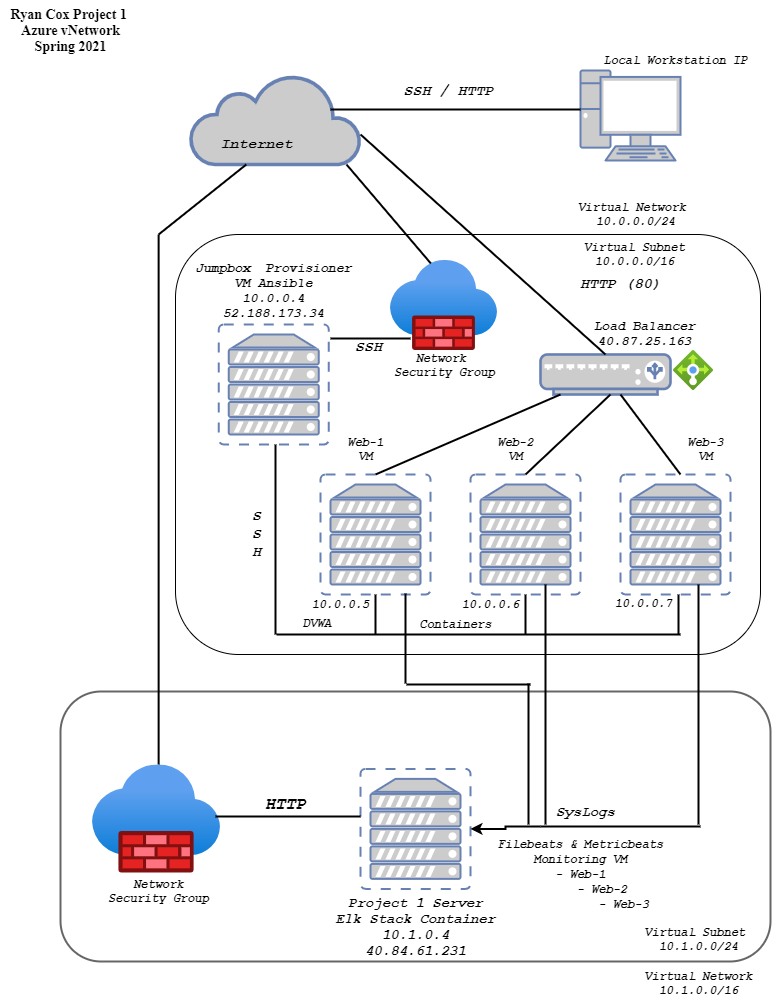

## Automated ELK Stack Deployment

The files in this repository were used to configure the network depicted below.

These files have been tested and used to generate a live ELK deployment on Azure. They can be used to either recreate the entire deployment pictured above. Alternatively, select portions of the _____ file may be used to install only certain pieces of it, such as Filebeat.

  - Install_ELK.yml

This document contains the following details:
- Description of the Topology
- Access Policies
- ELK Configuration
  - Beats in Use
  - Machines Being Monitored
- How to Use the Ansible Build

### Description of the Topology

The main purpose of this network is to expose a load-balanced and monitored instance of DVWA, the D*mn Vulnerable Web Application.

Load balancing ensures that the application will be highly available, in addition to restricting unauthorized access to the network.

Integrating an ELK server allows users to easily monitor the vulnerable VMs for changes to the logs and system traffic.
- Filebeat watches and monitors log files. Sending information to tools in the ELK stack it collects info on the files system and logs changes.
- Metric beat collects statistics abot the filesystem and sends them to tools on the ELK stack. As its name implies the mertics it collects give info about the files being monitored.

The configuration details of each machine may be found below.
_Note: Use the [Markdown Table Generator](http://www.tablesgenerator.com/markdown_tables) to add/remove values from the table_.

| Name            | Fuction   | I.P. Address | Operating System |
|-----------------|-----------|--------------|------------------|
| JumpBox-Ansible | Gateway   | 10.0.0.4     | Linux 18.04      |
| Web-1 DVWA VM   | Webserver | 10.0.0.5     | Linux 18.04      |
| Web-2 DVWA VM   | Webserver | 10.0.0.6     | Linux 18.04      |
| Web-3 DVWA VM   | Webserver | 10.0.0.7     | Linux 18.04      |
| ELK Server      | ELK Stack | 10.1.0.4     | Linux 18.04      |

### Access Policies

The machines on the internal network are not exposed to the public Internet. 

Only the JumpBox Provisioner machine can accept connections from the Internet. Access to this machine is only allowed from the following IP addresses:
- 'Personal Workstation IP'

Machines within the network can only be accessed by SSH through the JumpBox-Provisioner VM with the IP address 10.0.0.4.

A summary of the access policies in place can be found in the table below.

| Name            | Publicly Accessible | Allowed IP Address   |
|-----------------|---------------------|----------------------|
| JumpBox-Ansible | No                  | Only Personal IP     |
| Web-1 DVWA VM   | No                  | 10.0.0.4             |
| Web-2 DVWA VM   | No                  | 10.0.0.4             |
| Web-3 DVWA VM   | No                  | 10.0.0.4             |
| ELK Server      | No                  | 10.0.0.4/Personal IP |

### Elk Configuration

Ansible was used to automate configuration of the ELK machine. No configuration was performed manually, which is advantageous because of efficiency and consistency. 
By automating it the process will be consistant each time as well as it does not require the time and effort of configuring each use. This process also allows for easy changes when needed.

The playbook implements the following tasks:
- The header of the playbook establishes the creation of a new ELK VM with docker. It signifies the remote user for accessibility.
- Next the installation of Docker is initiated. The cache is updated when the playbook is run.
- Then the installation of Python3-pip to establish the language used to read the configuration.
- A sysctl module is then used to establish more memory for the installation.
- The next action is an image of the ELK container, specifically 761 is downloaded and launched. This is then started and has a restart: always policy included.
- Lastly there are specified port for the use of this container. These correlate with the Inbound rules creted for the Network Security Group that the new ELK server is protected with.

The following screenshot displays the result of running `docker ps` after successfully configuring the ELK instance.

### Target Machines & Beats
This ELK server is configured to monitor the following machines:
- The IP addresses are machines being monitored by the ELK services: (10.0.0.5) (10.0.0.6) (10.0.0.7)

We have installed the following Beats on these machines:
- The tools Filebeat and Metricbeat are installed and deployed through YAML playbooks, for this ELK server.

These Beats allow us to collect the following information from each machine:
- Filebeat collects logdata and ships it to other ELK stack tools such as elasticsearch and Logstash. There are a few items that collect data such as 'filebeat', which provides a count in the system module. 
- Another is 'Audibeat' that count data in categories such as file integrity, login data, packeges and users.
- Metricbeat collects and ships data statistics for each container.

### Using the Playbook
In order to use the playbook, you will need to have an Ansible control node already configured. Assuming you have such a control node provisioned: 

SSH into the control node and follow the steps below:
- Copy the _____ file to _____.
- Update the _____ file to include...
- Run the playbook, and navigate to ____ to check that the installation worked as expected.

_TODO: Answer the following questions to fill in the blanks:_
- _Which file is the playbook? Where do you copy it?_
- _Which file do you update to make Ansible run the playbook on a specific machine? How do I specify which machine to install the ELK server on versus which to install Filebeat on?_
- _Which URL do you navigate to in order to check that the ELK server is running?

_As a **Bonus**, provide the specific commands the user will need to run to download the playbook, update the files, etc._